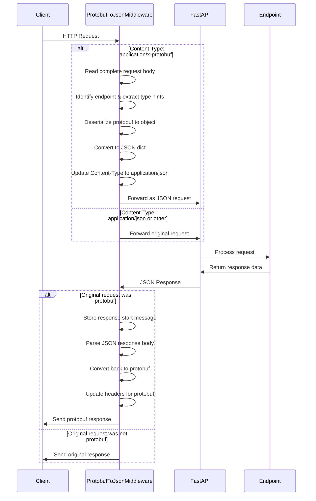
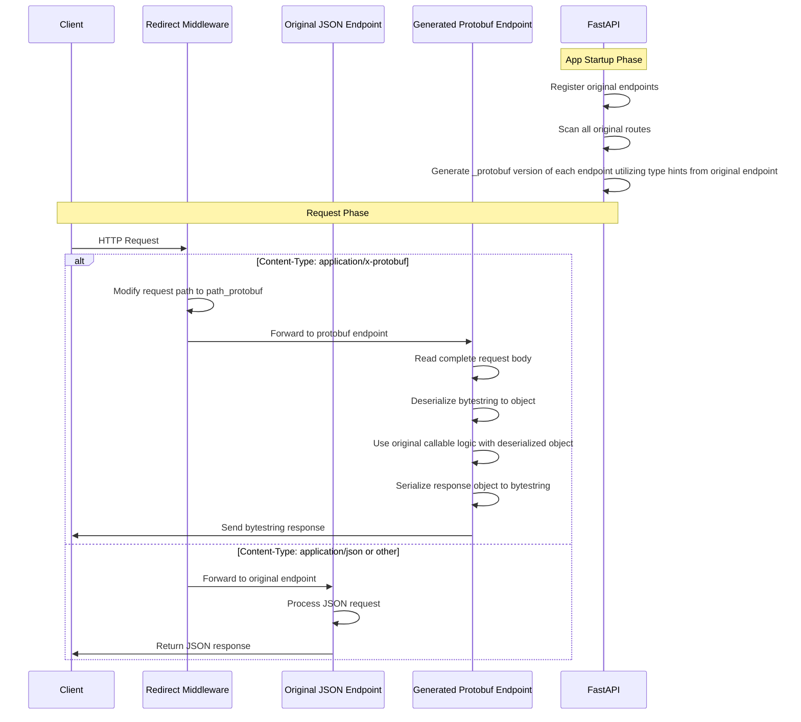

# FastAPI Protobuf example
## Introduction
This repository contains a simple example how to implement Protobuf payloads in REST APIs in Python.

[Protobuf](https://protobuf.dev/) is a binary serialization format that is used to serialize and deserialize data in a compact and efficient manner. It is a popular choice for high-performance applications, such as microservices (especially for backend services, which don't need to have a communication pattern with the frontend/web-browsers). Its advantages are:
- Small payload size
- Fast serialization and deserialization
- Strong typing
- Language agnostic proto definitions and code generation

Natural extension of Protobuf is [gRPC](https://grpc.io/), which is a high-performance, open-source and general RPC framework that enables similar language agnostic definitions of services through proto files and automatic generation of client and server code. However, gRPC cannot be used by the browsers natively and the serialized data is not human-readable.

On the other hand, in the world of web applications, JSON is the de-facto standard for data exchange with REST APIs being the most popular communication protocol.
JSON is human-readable and easy to understand, but it is not as compact as Protobuf and the serialization and deserialization is not as fast as with Protobuf. There is a multitude of REST API frameworks in different languages, I use Python's [FastAPI](https://fastapi.tiangolo.com/) in this example.

As a result, in the world of microservices, it is common to use both Protobuf and JSON for different use cases. A natural choice would be to use Protobuf and gRPC for the communication between backend services and JSON (potentially equivalents of proto messages) and REST APIs for the communication with the frontend.

However, sometimes (due to legacy reasons or other constraints) one must use REST APIs communication with the protobuf payloads. This example shows how to implement such a communication in Python.

### Preparation
This repository uses [UV](https://docs.astral.sh/uv/getting-started/installation/) as the package manager. Once you have UV installed, you can install the dependencies by running `uv sync`.
### Toy example
For the purpose of this example, a simple collection of proto messages is defined in `proto/messages.proto`.

```proto
syntax = "proto3";
package school;
import "google/protobuf/timestamp.proto";

message Student {
    string name = 1;
    float avg_grade = 2;
    google.protobuf.Timestamp dob = 3;
}

message Classroom {
    string profile = 1;
    repeated Student students = 2;
}

message ClassStats {
    int32 numstudents = 1;
    float grade = 2;
}

```

We want to implement a simple service that will ingest a `Classroom` message and return a `ClassStats` message containing the number of students and their average grade. All the implementations below will be in Python and each implementation will have a server and a client file.

## Simple gRPC implementation
Most natural way to implement this would be to use gRPC.
Then, one can define the service in a proto file and generate the client and server code. Example proto file is in `proto/grpc_service.proto`.

```proto
syntax = "proto3";
package school;
import "messages.proto";

service ClassroomSummary {
    rpc SummarizeClassroom (Classroom) returns (ClassStats) {}
}
```

After defining the messages and the service, one can generate the client and server code.

```bash
uv run python -m grpc_tools.protoc -I=proto --python_out=google_pb --pyi_out=google_pb --grpc_python_out=google_pb proto/*
```
Notes:
- `--pyi_out` is used to generate the Python type hints for better IDE support (without them the Protobuf messages are not recognized as valid Python classes in the IDE).
- `--grpc_python_out` is used to generate the gRPC client and server code.
- `google_pb` is the directory where the generated code will be saved.
- `grpc_tools.protoc` is the Protobuf compiler plugin for gRPC that has protoc compiler binary built in. For generating message code only you could use `protoc` directly, but you need to be careful about version compatibility.

Once the message and service code is generated, one can implement the server and client code.

```python
# grpc_google_server.py
"""Server implementation of the gRPC Classroom service using Google's protobuf library."""

import logging
import sys
from concurrent import futures

import grpc

sys.path.append("./google_pb")

from google_pb.grpc_service_pb2_grpc import ClassroomSummaryServicer, add_ClassroomSummaryServicer_to_server
from google_pb.messages_pb2 import Classroom, ClassStats

logger = logging.getLogger(__name__)
logger.setLevel(logging.INFO)


class ClassroomSummary(ClassroomSummaryServicer):
    """Classroom service implementation."""

    def SummarizeClassroom(self, request: Classroom, context: grpc.ServicerContext) -> ClassStats:  # noqa: N802, ARG002
        """Summarize the classroom."""
        logger.info("Summarizing classroom: %s", request)
        average_grade = sum(student.avg_grade for student in request.students) / len(request.students)
        num_students = len(request.students)

        return ClassStats(grade=average_grade, numstudents=num_students)


def serve(port: int = 50051) -> None:
    """Start the gRPC server."""
    server = grpc.server(futures.ThreadPoolExecutor(max_workers=10))
    add_ClassroomSummaryServicer_to_server(ClassroomSummary(), server)
    server.add_insecure_port(f"[::]:{port}")
    server.start()
    logger.info("Server started on port %s", port)
    server.wait_for_termination()


if __name__ == "__main__":
    logging.basicConfig(level=logging.INFO)
    serve()

```

```python
# grpc_google_client.py
"""gRPC client using Google protobuf objects."""

import asyncio
import datetime
import logging
import sys
from datetime import datetime as dt
from time import perf_counter

import grpc
from google.protobuf.timestamp_pb2 import Timestamp

sys.path.append("./google_pb")

from google_pb.grpc_service_pb2_grpc import ClassroomSummaryStub
from google_pb.messages_pb2 import Classroom, Student

# Configure logging
logger = logging.getLogger(__name__)
logger.setLevel(logging.INFO)
logger.addHandler(logging.StreamHandler(sys.stdout))


async def main(port: int = 50051) -> None:
    """Run the client."""
    timestamp = Timestamp()
    timestamp.FromDatetime(dt(1990, 1, 15, tzinfo=datetime.UTC))
    student_1 = Student(name="John", avg_grade=95.5, dob=timestamp)
    timestamp.FromDatetime(dt(1995, 2, 20, tzinfo=datetime.UTC))
    student_2 = Student(name="Jane", avg_grade=90.0, dob=timestamp)
    timestamp.FromDatetime(dt(1992, 3, 10, tzinfo=datetime.UTC))
    student_3 = Student(name="Jim", avg_grade=88.0, dob=timestamp)
    classroom = Classroom(profile="Math", students=[student_1, student_2, student_3])

    # Calculate request size in bytes
    request_size = sys.getsizeof(classroom)
    logger.info("Request size: %s bytes", request_size)

    # Create channel using grpcio
    channel = grpc.aio.insecure_channel(f"127.0.0.1:{port}")
    try:
        client = ClassroomSummaryStub(channel)
        start_time = perf_counter()
        response = await client.SummarizeClassroom(classroom)
        end_time = perf_counter()

        logger.info("Response: %s", response)
        logger.info("Execution time: %s ms", (end_time - start_time) * 1000)

        # Calculate response size in bytes
        response_size = sys.getsizeof(response.SerializeToString())
        logger.info("Response size: %s bytes", response_size)
    finally:
        await channel.close()


if __name__ == "__main__":
    asyncio.run(main())

```
The example client code uses 3 students with hardcoded values. One can run the server and client code by executing the following commands (in separate terminals):

```bash
uv run grpc_google_server.py
uv run grpc_google_client.py
```
to obtain the following output:

```
Request size: 80 bytes
Response: numstudents: 3
grade: 91.1666641

Execution time: 4.637499980162829 ms
Response size: 40 bytes
```

One drawback of such native implementation is that the gRPC generated code doesn't maintain the import structure well (hence `google_pb` directory is added to the `sys.path`). And of course, it's not REST compatible. Native protobuf implementation is also not very good at handling data types - one can see that the timestamps first need to be created separately as Timestamp messages, and then passed to the Student message (Python datetimes are not handled out of the box).

## REST implementation with FastAPI
There are multiple ways to integrate Protobuf payloads with FastAPI. All of those have their own pros and cons. REST is a text-based protocol, so protobuf messages will be serialized into one of the text formats.
### Native byte string serialization
The simplest way is to serialize the protobuf message into a byte string and send this string over as payload.

```python
# fastapi_google_string_server.py
from fastapi import FastAPI, HTTPException, Request
from fastapi.responses import Response

from google_pb.messages_pb2 import Classroom, ClassStats

app = FastAPI()


@app.post("/classroom")
async def summarize_classroom(request: Request) -> Response:
    """Summarize the classroom."""
    try:
        classroom_string: bytes = await request.body()
        classroom = Classroom.FromString(classroom_string)
        avg_grade = sum(student.avg_grade for student in classroom.students) / len(classroom.students)
        classroom_stats_object = ClassStats(numstudents=len(classroom.students), grade=avg_grade)
        classroom_stats_string = classroom_stats_object.SerializeToString()
        return Response(status_code=200, content=classroom_stats_string)
    except Exception as e:
        raise HTTPException(status_code=400, detail=f"Exception: {e!s}") from e


if __name__ == "__main__":
    uvicorn.run(app, host="127.0.0.1", port=8000)

```

```python
# fastapi_google_string_client.py
"""Client implementation for FastAPI using Google protobuf string serialization."""

import datetime
import logging
import sys
from datetime import datetime as dt
from time import perf_counter

import requests
from google.protobuf.timestamp_pb2 import Timestamp

from google_pb.messages_pb2 import Classroom, ClassStats, Student

logger = logging.getLogger(__name__)
logger.setLevel(logging.INFO)
logger.addHandler(logging.StreamHandler(sys.stdout))

def main() -> None:
    """Run the client."""
    timestamp = Timestamp()
    timestamp.FromDatetime(dt(1990, 1, 15, tzinfo=datetime.UTC))
    student_1 = Student(name="John", avg_grade=95.5, dob=timestamp)
    timestamp.FromDatetime(dt(1995, 2, 20, tzinfo=datetime.UTC))
    student_2 = Student(name="Jane", avg_grade=90.0, dob=timestamp)
    timestamp.FromDatetime(dt(1992, 3, 10, tzinfo=datetime.UTC))
    student_3 = Student(name="Jim", avg_grade=88.0, dob=timestamp)
    classroom = Classroom(profile="Math", students=[student_1, student_2, student_3])

    message_size = sys.getsizeof(classroom.SerializeToString())
    logger.info("Serialized (byte string) vanilla PB message size is %s bytes.", message_size)

    t0 = perf_counter()
    classroom_string = classroom.SerializeToString()
    response = requests.post("http://127.0.0.1:8000/classroom", data=classroom_string, timeout=10)
    logger.info("Response status code: %s", response.status_code)
    result_msg = ClassStats.FromString(response.content)
    t1 = perf_counter()
    response_size = sys.getsizeof(response.content)
    logger.info("Response size: %s bytes", response_size)
    logger.info("Time to receive response: %s miliseconds. Result message: %s", (t1 - t0) * 1000, result_msg)


if __name__ == "__main__":
    main()

```
This implementation is simple and easy to understand, but it has a few drawbacks:
- FastAPI has no information about the message structure, so all the automatic endpoint documentation and validation is not available.
- One has to manually implement the serialization, deserialization and potential validation of the protobuf message within the endpoint logic.
- Default error handling is not very informative and one has to manually implement the error handling for each error type.

Even though the original goal is achieved, it's not very RESTful and not very user- or developer-friendly.

The performance is still pretty good though:
```
Serialized (byte string) vanilla PB message size is 101 bytes.
Response status code: 200
Response size: 40 bytes
Time to receive response: 4.607899987604469 miliseconds. Result message: numstudents: 3
grade: 91.1666641
```

### Native JSON serialization
Apart from the byte string serialization, one can also serialize the protobuf message into JSON. FastAPI used JSON serializable data models to define interfaces for the endpoints. While the protobuf generated message classes cannot be used by FastAPI directly, one can create their [Pydantic](https://docs.pydantic.dev) `BaseModel` equivalents:

```python
# fastapi_google_json_models.py
"""Pydantic models for Google protobuf messages."""

from datetime import datetime

from pydantic import BaseModel


class Student(BaseModel):
    """Student model."""

    name: str
    avg_grade: float
    dob: datetime


class Classroom(BaseModel):
    """Classroom model."""

    profile: str
    students: list[Student]


class ClassStats(BaseModel):
    """Class statistics model."""

    numstudents: int
    grade: float


```

Then, the server definition becomes very Pythonic and we get back all the FastAPI features:

```python
# fastapi_google_json_server.py
"""FastAPI server for Google protobuf messages with JSON serialization."""

import uvicorn
from fastapi import FastAPI

from fastapi_google_json_models import Classroom, ClassStats

app = FastAPI()


@app.post("/classroom")
async def summarize_classroom(classroom: Classroom) -> ClassStats:
    """Summarize the classroom."""
    avg_grade = sum(student.avg_grade for student in classroom.students) / len(classroom.students)
    return ClassStats(numstudents=len(classroom.students), grade=avg_grade)


if __name__ == "__main__":
    uvicorn.run(app, host="127.0.0.1", port=8000)

```
The protobuf messages are now serialized into JSON and the server can use the Pydantic models to validate the incoming data:

```python
"""Client implementation for FastAPI using google protobuf JSON serialization."""

import datetime
import logging
import sys
from datetime import datetime as dt
from time import perf_counter

import requests
from google.protobuf import json_format
from google.protobuf.timestamp_pb2 import Timestamp

from google_pb.messages_pb2 import Classroom, ClassStats, Student

logger = logging.getLogger(__name__)
logger.setLevel(logging.INFO)
logger.addHandler(logging.StreamHandler(sys.stdout))


def main() -> None:
    """Run the client."""
    timestamp = Timestamp()
    timestamp.FromDatetime(dt(1990, 1, 15, tzinfo=datetime.UTC))
    student_1 = Student(name="John", avg_grade=95.5, dob=timestamp)
    timestamp.FromDatetime(dt(1995, 2, 20, tzinfo=datetime.UTC))
    student_2 = Student(name="Jane", avg_grade=90.0, dob=timestamp)
    timestamp.FromDatetime(dt(1992, 3, 10, tzinfo=datetime.UTC))
    student_3 = Student(name="Jim", avg_grade=88.0, dob=timestamp)
    classroom = Classroom(profile="Math", students=[student_1, student_2, student_3])

    message_size = sys.getsizeof(json_format.MessageToDict(classroom, preserving_proto_field_name=True))
    logger.info("JSON message size from vanilla protobuf: %s bytes", message_size)

    t0 = perf_counter()
    classroom_json = json_format.MessageToDict(classroom, preserving_proto_field_name=True)
    response = requests.post("http://127.0.0.1:8000/classroom", json=classroom_json, timeout=10)
    logger.info("Response status code: %s", response.status_code)
    logger.info("Response JSON: %s", response.json())
    result_msg = json_format.ParseDict(response.json(), ClassStats())
    t1 = perf_counter()
    response_size = sys.getsizeof(response.content)
    logger.info("Response size: %s bytes", response_size)
    logger.info("Time to receive response: %s miliseconds. Result message: %s", (t1 - t0) * 1000, result_msg)


if __name__ == "__main__":
    main()

```
Code readability is much better and the FastAPI features are back, but the performance is worse:
```
JSON message size from vanilla protobuf: 184 bytes
Response status code: 200
Response JSON: {'numstudents': 3, 'grade': 91.16666666666667}
Response size: 76 bytes
Time to receive response: 4.685299994889647 miliseconds. Result message: numstudents: 3
grade: 91.1666641
```
Payload size is significantly larger and the response times are worse too. In addition, the neccessity of manually writing separate Pydantic models for each protobuf message is a bit inconvenient.
### Betterproto JSON Serialization
[Betterproto](https://github.com/danielgtaylor/python-betterproto) is a library that provides a more user-friendly way to work with Protobuf messages in Python. It's a proto compiler plugin that generates Python code from proto files in the form of [Data Classes](https://docs.python.org/3/library/dataclasses.html). Those are much more user and developer friendly than the native protobuf generated code. There is also a better type support for Python native types.

In order to generate the betterproto code, one can use the following command:
```bash
python -m grpc_tools.protoc -I=proto --python_betterproto_out=betterproto_pb proto/*
```
The generated dataclasses can be used by FastAPI directly:

```python
# fastapi_better_json_server.py
import uvicorn
from fastapi import FastAPI

from betterproto_pb.school import Classroom, ClassStats

app = FastAPI()


@app.post("/classroom")
async def summarize_classroom(classroom: Classroom) -> ClassStats:
    """Summarize the classroom."""
    return ClassStats(
        numstudents=len(classroom.students),
        grade=sum(student.avg_grade for student in classroom.students) / len(classroom.students),
    )


if __name__ == "__main__":
    uvicorn.run(app, host="127.0.0.1", port=8000)


```

And the creation of object in the client is much nicer too:

```python
# fastapi_better_json_client.py
"""Client implementation for FastAPI using betterproto."""

import datetime
import logging
import sys
from datetime import datetime as dt
from time import perf_counter

import requests
from betterproto import Casing

from betterproto_pb.school import Classroom, ClassStats, Student

logger = logging.getLogger(__name__)
logger.setLevel(logging.INFO)
logger.addHandler(logging.StreamHandler(sys.stdout))

def main() -> None:
    """Run the client."""
    student_1 = Student(name="John", avg_grade=95.5, dob=dt(1990, 1, 15, tzinfo=datetime.UTC))
    student_2 = Student(name="Jane", avg_grade=90.0, dob=dt(1995, 2, 20, tzinfo=datetime.UTC))
    student_3 = Student(name="Jim", avg_grade=88.0, dob=dt(1992, 3, 10, tzinfo=datetime.UTC))
    classroom = Classroom(profile="Math", students=[student_1, student_2, student_3])

    message_size = sys.getsizeof(classroom.to_dict(Casing.SNAKE))  # type: ignore[attr-defined]
    logger.info("JSON message size from betterproto PB: %s bytes", message_size)

    t0 = perf_counter()
    classroom_json = classroom.to_dict(Casing.SNAKE)  # type: ignore[attr-defined]
    response = requests.post("http://127.0.0.1:8000/classroom", json=classroom_json, timeout=10)
    logger.info("Response status code: %s", response.status_code)
    logger.info("Response JSON: %s", response.json())
    result_msg = ClassStats(**response.json())
    t1 = perf_counter()
    response_size = sys.getsizeof(response.content)
    logger.info("Response size: %s bytes", response_size)
    logger.info("Time to receive response: %s miliseconds. Result message: %s", (t1 - t0) * 1000, result_msg)


if __name__ == "__main__":
    main()
```
The performance took another minor hit, but the code is much more readable and the development experience is much better:
```
JSON message size from betterproto PB: 184 bytes
Response status code: 200
Response JSON: {'numstudents': 3, 'grade': 91.16666666666667}
Response size: 76 bytes
Time to receive response: 4.980399971827865 miliseconds. Result message: ClassStats(numstudents=3, grade=91.16666666666667)
```
## Mixed payload endpoints
Simple examples above always assumed that the protobuf messages are alway parsed one way or another (byte string or JSON). However, in practice one might need to support both JSON and bytestring payloads in the same endpoint (for example JSON for testing and bytestring for performance). Such an implementation is not natively supported by FastAPI, but one can lean on the underlying [ASGI](https://asgi.readthedocs.io/en/latest/) standard to implement such a functionality.
Two such implementations are presented below, in both cases the server will accept both JSON and bytestring payloads and the request headers will be used to determine the payload type.
### ASGI middleware implementation
In the first implementation, the FastAPI app has only JSON endpoints and the ASGI middleware will detect potential bytestring payload and convert it to JSON before passing to the endpoint and then convert the response back to bytestring before sending it back to the client.


The server implementation can be found below:

```python
# fastapi_better_mixed_server_asgi.py
"""FastApi server accepting both JSON and Protobuf requests using translating middleware."""

import json
from typing import get_type_hints

import betterproto
import uvicorn
from fastapi import FastAPI, HTTPException
from fastapi.routing import APIRoute
from starlette.types import ASGIApp, Message, Receive, Scope, Send

from betterproto_pb.school import Classroom, ClassStats

app = FastAPI()


class ProtobufToJsonMiddleware:
    """ASGI middleware to translate Protobuf requests to JSON."""

    start_message: Message

    def __init__(self, app: ASGIApp) -> None:
        """Initialize the middleware with the ASGI app."""
        self.app = app

    async def __call__(self, scope: Scope, receive: Receive, send: Send) -> None:  # noqa: C901
        """Call the middleware."""
        is_protobuf = False
        json_body = b""
        return_object = None

        # Define new_receive outside the if block
        async def new_receive() -> Message:
            if not is_protobuf:
                return await receive()
            return {
                "type": "http.request",
                "body": json_body,
                "more_body": False,  # Important: indicate this is the complete body
            }

        async def new_send(message: Message) -> None:
            if is_protobuf:
                if message["type"] == "http.response.start":
                    # Store the start message but don't send it yet
                    self.start_message = message
                    return
                if message["type"] == "http.response.body":
                    json_body = message["body"]
                    response_data = json.loads(json_body.decode("utf-8"))
                    proto_response = return_object(**response_data)  # type: ignore[arg-type]
                    proto_body = proto_response.SerializeToString()

                    # Preserve original headers and update only content-type and content-length
                    headers = [
                        (k, v)
                        for k, v in self.start_message["headers"]
                        if k.lower() not in [b"content-type", b"content-length"]
                    ]
                    headers.extend(
                        [
                            (b"content-length", str(len(proto_body)).encode("utf-8")),
                            (b"content-type", b"application/x-protobuf"),
                        ]
                    )

                    # Now send both messages in the correct order
                    await send({**self.start_message, "headers": headers})
                    await send(
                        {
                            "type": "http.response.body",
                            "body": proto_body,
                            "more_body": False,
                        }
                    )
                    return
            await send(message)

        if scope["type"] == "http" and scope["headers"]:
            headers_dict = dict(scope["headers"])
            content_type = headers_dict.get(b"content-type")
            if content_type and content_type == b"application/x-protobuf":
                is_protobuf = True
                # Read the body of the request
                body = b""
                more_body = True
                while more_body:
                    message = await receive()
                    body += message.get("body", b"")
                    more_body = message.get("more_body", False)
                # Determine protobuf object type
                for route in app.routes:
                    if isinstance(route, APIRoute) and route.path == scope["path"]:
                        route_func = route.endpoint
                        break
                else:
                    raise HTTPException(status_code=404, detail="Endpoint not found")
                type_hints = get_type_hints(route_func)
                return_object = type_hints.pop("return", None)
                if not return_object:
                    raise HTTPException(status_code=400, detail="Protobuf message type not found in endpoint signature")

                input_protobuf_class: betterproto.Message | None = next(
                    (hint for hint in type_hints.values() if hasattr(hint, "FromString")),
                    None,
                )
                if not input_protobuf_class:
                    raise HTTPException(status_code=400, detail="Protobuf message type not found in endpoint signature")

                # Deserialize the body into the protobuf object
                proto_object = input_protobuf_class.FromString(body)
                json_data = proto_object.to_dict(betterproto.Casing.SNAKE)  # type: ignore[arg-type]
                json_body = json.dumps(json_data).encode("utf-8")

                # Update scope headers
                scope["headers"] = [
                    (k, v) if k != b"content-type" else (k, b"application/json") for k, v in scope["headers"]
                ]

        # Always use new_send to handle both protobuf and non-protobuf cases
        await self.app(scope, new_receive, new_send)


app = FastAPI()
app.add_middleware(ProtobufToJsonMiddleware)


@app.post("/classroom")
async def summarize_classroom(classroom: Classroom) -> ClassStats:
    """Summarize the classroom."""
    return ClassStats(
        numstudents=len(classroom.students),
        grade=sum(student.avg_grade for student in classroom.students) / len(classroom.students),
    )


if __name__ == "__main__":
    uvicorn.run(app, host="127.0.0.1", port=8000)

```
Then the client sending both JSON and bytestring payloads can be implemented as follows:

```python
# fastapi_better_mixed_client.py
"""Client for the FastAPI server that supports both JSON and Protobuf requests."""

import datetime
import logging
import sys
from datetime import datetime as dt
from time import perf_counter

import betterproto
import requests

from betterproto_pb.school import Classroom, ClassStats, Student

logger = logging.getLogger(__name__)
logger.setLevel(logging.INFO)
logger.addHandler(logging.StreamHandler(sys.stdout))


def main() -> None:
    """Test server endpoint with both JSON and Protobuf requests."""
    student_1 = Student(name="John", avg_grade=95.5, dob=dt(1990, 1, 15, tzinfo=datetime.UTC))
    student_2 = Student(name="Jane", avg_grade=92.3, dob=dt(1995, 2, 20, tzinfo=datetime.UTC))
    student_3 = Student(name="Jim", avg_grade=88.0, dob=dt(1992, 3, 10, tzinfo=datetime.UTC))
    classroom = Classroom(profile="Math", students=[student_1, student_2, student_3])

    logger.info("Running JSON request...")
    message_size = sys.getsizeof(classroom.to_dict(betterproto.Casing.SNAKE))  # type: ignore[arg-type]
    logger.info("JSON message size: %s bytes", message_size)
    t0 = perf_counter()
    classroom_json = classroom.to_dict(betterproto.Casing.SNAKE)  # type: ignore[arg-type]
    response = requests.post("http://127.0.0.1:8000/classroom", json=classroom_json, timeout=10)
    logger.info("JSON response size: %s bytes", sys.getsizeof(response.content))
    logger.info("JSON response status code: %s", response.status_code)
    result_object = ClassStats(**response.json())
    logger.info("JSON request completed in %s miliseconds", (perf_counter() - t0) * 1000)
    logger.info("Response: %s", result_object)

    logger.info("Running Protobuf request...")
    message_size = sys.getsizeof(classroom.SerializeToString())
    logger.info("Protobuf message size: %s bytes", message_size)
    t0 = perf_counter()
    response = requests.post(
        "http://127.0.0.1:8000/classroom",
        headers={"Content-Type": "application/x-protobuf"},
        data=classroom.SerializeToString(),
        timeout=10,
    )
    logger.info("Protobuf response size: %s bytes", sys.getsizeof(response.content))
    logger.info("Protobuf response status code: %s", response.status_code)
    result_object = ClassStats().FromString(response.content)
    logger.info("Protobuf request completed in %s miliseconds", (perf_counter() - t0) * 1000)
    logger.info("Response: %s", result_object)


if __name__ == "__main__":
    main()

```
Similarly to before, bytestring serialization is slightly faster than JSON and has smaller messages:
```
Running JSON request...
JSON message size: 184 bytes
JSON response size: 76 bytes
JSON response status code: 200
JSON request completed in 5.855499999597669 miliseconds
Response: ClassStats(numstudents=3, grade=91.93333333333334)
Running Protobuf request...
Protobuf message size: 101 bytes
Protobuf response size: 40 bytes
Protobuf response status code: 200
Protobuf request completed in 4.7723000170663 miliseconds
Response: ClassStats(numstudents=3, grade=91.93333435058594)
```
The main goal was achieved - single server can process both request types.
### Endpoint routing implementation
Alternative approach is to have separate endpoints for JSON and bytestring payloads. The server will then use the request headers to determine the payload type and route the request to the appropriate endpoint. Of course, we don't want developer to manually duplicate the endpoint logic, so the hidden protobuf endpoints will be generated programatically. Then simple ASGI middleware will detect header type and route the request to the appropriate endpoint.

The server implementation can be found below:

```python
# fastapi_better_mixed_server_endpoints.py
"""FastAPI server that supports both JSON and Protobuf endpoints using autogenerated protobuf endpoints."""

from collections.abc import Awaitable, Callable
from typing import TYPE_CHECKING, get_type_hints

import uvicorn
from fastapi import FastAPI, HTTPException, Request
from fastapi.responses import Response
from fastapi.routing import APIRoute

from betterproto_pb.school import Classroom, ClassStats

if TYPE_CHECKING:
    import betterproto

app = FastAPI()


def generate_protobuf_endpoint(route: APIRoute) -> Callable[[Request], Awaitable[Response]]:
    """Generate a protobuf endpoint callable for a given route."""

    async def protobuf_endpoint(request: Request) -> Response:
        body = await request.body()
        type_hints = get_type_hints(route.endpoint)
        input_protobuf_class: betterproto.Message | None = next(
            (hint for hint in type_hints.values() if hasattr(hint, "FromString")),
            None,
        )
        if not input_protobuf_class:
            raise HTTPException(status_code=400, detail="Protobuf message type not found in endpoint signature")
        input_proto_object = input_protobuf_class.FromString(body)
        response_proto_object: betterproto.Message = await route.endpoint(input_proto_object)
        return Response(response_proto_object.SerializeToString(), media_type="application/x-protobuf")

    return protobuf_endpoint


def add_protobuf_endpoints(app: FastAPI) -> None:
    """Add all protobuf endpoints to the app."""
    new_routes = []
    for route in app.routes:
        if isinstance(route, APIRoute):
            protobuf_route = APIRoute(
                path=f"{route.path}_protobuf",
                endpoint=generate_protobuf_endpoint(route),
                methods=route.methods,
                name=f"{route.name}_protobuf",
                response_class=Response,
                status_code=route.status_code,
                tags=route.tags,
                dependencies=route.dependencies,
                summary=route.summary,
                description=route.description,
                response_description=route.response_description,
                responses=route.responses,
                deprecated=route.deprecated,
                operation_id=route.operation_id,
                include_in_schema=route.include_in_schema,
                response_model_include=route.response_model_include,
                response_model_exclude=route.response_model_exclude,
                response_model_exclude_none=route.response_model_exclude_none,
                response_model_exclude_unset=route.response_model_exclude_unset,
                response_model_exclude_defaults=route.response_model_exclude_defaults,
                response_model_by_alias=route.response_model_by_alias,
            )
            new_routes.append(protobuf_route)
    app.routes.extend(new_routes)


@app.post("/classroom")
async def summarize_classroom(classroom: Classroom) -> ClassStats:
    """Summarize the classroom."""
    return ClassStats(
        numstudents=len(classroom.students),
        grade=sum(student.avg_grade for student in classroom.students) / len(classroom.students),
    )


add_protobuf_endpoints(app)


@app.middleware("http")
async def redirect_protobuf(request: Request, call_next: Callable[[Request], Awaitable[Response]]) -> Response:
    """Redirect protobuf requests to the protobuf endpoint."""
    if request.headers.get("Content-Type") == "application/x-protobuf":
        request.scope["path"] = f"{request.scope['path']}_protobuf"
    return await call_next(request)


if __name__ == "__main__":
    uvicorn.run(app, host="127.0.0.1", port=8000)
```
Same client as above is used again, and the results are slightly better (probably by avoding the JSON serialization overhead):
```
Running JSON request...
JSON message size: 184 bytes
JSON response size: 76 bytes
JSON response status code: 200
JSON request completed in 5.236600001808256 miliseconds
Response: ClassStats(numstudents=3, grade=91.93333333333334)
Running Protobuf request...
Protobuf message size: 101 bytes
Protobuf response size: 40 bytes
Protobuf response status code: 200
Protobuf request completed in 3.4413000103086233 miliseconds
Response: ClassStats(numstudents=3, grade=91.93333435058594)
```
However, this implementation also sometimes has latency spikes (20-30ms) which are not present in the previous implementation, reason for which is not clear.

## More on betterproto
Better proto isn't helpful only for REST implementations only, but for broader use cases too. However, one must be aware of some of the trade-offs.
### Speed disadvantage
In general betterproto serialization/deserialization is much slower than native google protobuf implementation (x100-x1000). This might not be a problem for use cases, where the messages are small and communication is I/O limited, but may become a serious issue for high-performance use cases.
### Better gRPC code
Better proto also generates gRPC-like service code. It is better organized (into a proper Python module) than the native implementation and more readable too.
The reimplementation of the original gRPC example using betterproto code is presented below:

```python
# grpc_better_server.py
"""gRPC server using betterproto objects."""

from __future__ import annotations

import asyncio
import logging
import sys

from grpclib.server import Server

from betterproto_pb.school import Classroom, ClassroomSummaryBase, ClassStats

logger = logging.getLogger(__name__)
logger.setLevel(logging.INFO)
logger.addHandler(logging.StreamHandler(sys.stdout))


class ClassroomSummary(ClassroomSummaryBase):
    """Classroom summary service."""

    async def summarize_classroom(self, classroom: Classroom) -> ClassStats:
        """Summarize the classroom."""
        logger.info("Received classroom: %s", classroom)

        return ClassStats(
            numstudents=len(classroom.students),
            grade=sum(student.avg_grade for student in classroom.students) / len(classroom.students),
        )


async def main(port: int = 50051) -> None:
    """Run the server."""
    server = Server([ClassroomSummary()])
    await server.start("127.0.0.1", port)
    logger.info("Server started on 127.0.0.1:%s", port)
    await server.wait_closed()


if __name__ == "__main__":
    asyncio.run(main())
```
And the client implementation:
```python
# grpc_better_client.py
"""Client implementation for gRPC service using betterproto objects."""

import asyncio
import datetime
import logging
import sys
from datetime import datetime as dt
from time import perf_counter

from grpclib.client import Channel

from betterproto_pb.school import Classroom, ClassroomSummaryStub, Student

logger = logging.getLogger(__name__)
logger.setLevel(logging.INFO)
logger.addHandler(logging.StreamHandler(sys.stdout))

async def main(port: int = 50051) -> None:
    """Run the client."""
    student_1 = Student(name="John", avg_grade=95.5, dob=dt(1990, 1, 15, tzinfo=datetime.UTC))
    student_2 = Student(name="Jane", avg_grade=92.3, dob=dt(1995, 2, 20, tzinfo=datetime.UTC))
    student_3 = Student(name="Jim", avg_grade=88.0, dob=dt(1992, 3, 10, tzinfo=datetime.UTC))
    classroom = Classroom(profile="Math", students=[student_1, student_2, student_3])

    # Calculate request size in bytes
    request_size = sys.getsizeof(classroom)
    logger.info("Request size: %s bytes", request_size)

    async with Channel("127.0.0.1", port) as channel:
        client = ClassroomSummaryStub(channel)

        # Measure execution time
        start_time = perf_counter()
        response = await client.summarize_classroom(classroom)
        end_time = perf_counter()

        # Calculate response size in bytes
        response_size = sys.getsizeof(response.SerializeToString())

        # Print results
        logger.info("Response: %s", response)
        logger.info("Execution time: %s ms", (end_time - start_time) * 1000)
        logger.info("Response size: %s bytes", response_size)


if __name__ == "__main__":
    asyncio.run(main())
```


